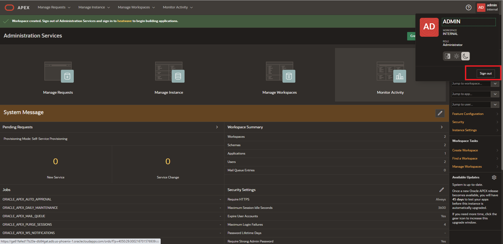

# Create a Low Code Application with Oracle APEX and REST SERVICES for MySQL


## Introduction

The Oracle Database Development Tools team launched the Database Tools service in OCI providing instance web browser to create connections to the MySQL Database Service in OCI.

Using APEX, developers can quickly develop and deploy compelling apps that solve real problems and provide immediate value. You don't need to be an expert in a vast array of technologies to deliver sophisticated solutions. Focus on solving the problem and let APEX take care of the rest. [https://apex.oracle.com/en/platform/why-oracle-apex/](https://apex.oracle.com/en/platform/why-oracle-apex/)

**Tasks Support Guides**
- [https://medium.com/oracledevs/get-insight-on-mysql-data-using-apex](https://medium.com/oracledevs/get-insight-on-mysql-data-using-apex-22-1-7fe613c76ca5)
- [https://peterobrien.blog/2022/06/15/](https://peterobrien.blog/2022/06/15/)
- [https://peterobrien.blog/2022/06/15/how-to-use-the-oracle-database-tools-service-to-provide-data-to-apex/](https://peterobrien.blog/2022/06/15/how-to-use-the-oracle-database-tools-service-to-provide-data-to-apex/)

_Estimated Time:_ 15 minutes

### Objectives

In this lab, you will be guided through the following task:

- Create and configure an APEX Instance
- Configure APEX Rest Service

### Prerequisites

- An Oracle Trial or Paid Cloud Account
- Some Experience with OCI Console
- Some Experience with Oracle Autonomous and Oracle APEX
- Completed Lab 5

## Task 1 Run SQL Worksheet

1. From the OCI Menu, navigate to **Developer Services** and click **SQL Worksheet**

    

2. elect the root compartment and the created **HW-Connection**

3. You can run SQL queries, in the SQL Worksheet.

    a. List the schemas

    ```bash
    <copy> SHOW SCHEMAS;</copy>
    ```

4. Get the MySQL Connection Endpoint URL

    The OCI Services connect to the MySQL DB System though the created Connection. This Connection Endpoint Consists of a URL Pattern:

    **Note** The pattern is `https://sql.dbtools.< region >.oci.oraclecloud.com/20201005/ords/< connection ocid >/_/sql`

    **Example** <https://sql.dbtools.us-ashburn-1.oci.oraclecloud.com/20201005/ords/ocid1.databasetoolsconnection.oc1.iad.amaaaaaao27h4wiamnbgbmuznwvg4nenu4j7nzbecnvpmzgs2fkgiugwueyq/_/sql>

    This URL can be also obtained by retrieving it from the network logs from the developer console in a Web Browser.

    a. Open the Developer Console from your web browser. This can be done by right clicking on the page and clicking **inspect/inspect element**

    

    b. In the developer **console** tab, look up for **dbtools-sqldev__LogEvent**. There you can click on the object to see its details

    

    c. The Endpoint URL will be visible. Right Click to Copy the Link

    

    d. Notice the pattern of the URL

    e. Save the Endpoint URL for later

## Task 2 Create API Keys

1. From the OCI Menu, navigate to **Identity & Security** and click **Domains**

    

2. Click on **Default** domain and navigate to **Users**

    

3. Click on your current user

    

4. Click **Add API Key**

5. Save the generated API Key Pair

    

6. Save the content of the Configuration file preview by **copying** it. Then click **Close**

    

    **Notice the Values for your Username, Tenancy, Region, Fingerprint**

## Task 3 Create and Configure an APEX Instance

1. Create and Launch APEX

    a.
    
    
    b. Choose root compartment and set APEX password
    
    

2. Create Workspace

    a.
    

    
    b. Name the APEX workspace

    ```bash
    <copy> heatwave</copy>
    ```

    c. Set an Admin user and password for the workspace
    
    d. Log out from APEX
    


## Task 4 Create APEX Credentials

1. Create Web Credentials

    a. Log In to the APEX Workspace
    
    b. Navigate to the Workspace Utilities from the App Builder Menu
    
    c. Click on **Web Credentials**
    

    d. You can obtain the OCID values and fingerprint from the **Configuration File Preview** generated with the API Key or retrieve them from the OCI Console. Open the Private Key file in a text editor to copy the content.

    | Attributes | Value |
    | --------| -------:|
    | Name | mysqlheatwave |
    | Static ID | mysqlheatwave |
    | Authentication Type | Oracle Cloud Infraestructure (OCI) |
    | OCI User ID | **< YourUserOCID >** |
    | OCI Private Key | **< ContentOfYourSavedPrivateKey >** |
    | OCI Tenancy ID | **< YourTenancyOCID >** |
    | OCI Public Key Fingerprint | **< YourPublicKeyFingerprint >** |
    | Valid for URLs | **< EndpointURL >** |
    {: title="Web Credentials \| Attributes"}

    e. Create new Web Credentials. Click **Create**
    

## Task 5 Create APEX Rest Service

1. Navigate to the Workspace Utilities from the App Builder Menu
    

2. Click on **REST Enabled SQL Services**
    

3. Click **Create**

    

4. Give the REST service a name

    ```bash
    <copy> HeatWave </copy>
    ```

5. For Endpoint URL, Introduce the Endpoint URL **without** the "**`/_/sql`**" at the end. Notice the help message.

6. Click **Next**

7. Select the previously created credentials. Click **Create**

    

8. If previous steps were performed correctly, you should see a successful connection. Select the default database **world**

    

## Task 6 Create APEX Application

1. Connect to your APEX Workspace:

    a. Connect to your APEX workspace

    b. Go to App Builder

    

    

2. Enter Application Name

    ```bash
    <copy>World</copy>
    ```

   

3. Click the **Create Application** button

   

4. Click the **Create Page** button

   

5. Select the **Chart** component and click the **Next** button

   

6. Select the **Pie Chart** component and click the **Next** button

   

7. In the **Create Chart** dialog box enter the following values
    - a. **Chart Name:** Top 5 World Populations
    - b. **Data Source:** REST Enabled SQL Service
    - c. **REST Enabled SQL Service** HeatWave
    - d. **Source Type** SQL Query
    - e. **Enter a SQL SELECT statement**

        ```bash
        <copy>SELECT name as country, population  FROM world.country 
        order by population desc  limit 5;</copy>
        ```

    - Click the **Next** button

8. In the **Create Chart** dialog box make the following selection

   

    - a. **Label Column:** country
    - b. **Value Column:** population
    - Click the **Create Page** button

9. Click the green **Run** button

   

10. In the **Signin** page  enter the workspace username and password

   

This concludes this lab. You may now **proceed to the next lab.**

## Learn More

- How to use the Oracle Database Tools Service to provide MySQL data to APEX - [APEX and the MySQL Database Service](https://asktom.oracle.com/pls/apex/asktom.search?oh=18245)

- [Oracle Autonomous Database Serverless Documentation](https://docs.oracle.com/en/cloud/paas/autonomous-database/serverless/adbsb/index.html#Oracle%C2%AE-Cloud)

- [Using Web Services with Oracle APEX Documentation](https://docs.oracle.com/en/cloud/paas/autonomous-database/serverless/adbsb/apex-web-services.html#GUID-DA24C605-384D-4448-B73C-D00C02F5060E)


## Acknowledgements

- **Author** - Cristian Aguilar, MySQL Solution Engineering
- **Contributors** - Perside Foster, MySQL Principal Solution Engineering
- **Last Updated By/Date** - Perside Foster, MySQL Principal Solution Engineerin, April 2024
