# Connect to HeatWave with OCI SQL Worksheet


## Introduction

The SQL Worksheet provides a web-based SQL workspace where you can enter SQL statements directly in the browser using a database connection. From the SQL Worksheet, you can run SQL statements or scripts against the database, and create database objects.

Some of the SQL Worksheet features are not available for MySQL database services. This is indicated with a note in the following topics where applicable. [Using the SQL Worksheet](https://docs.oracle.com/en-us/iaas/database-tools/doc/using-oracle-cloud-infrastructure-console.html)

_Estimated Time:_ 15 minutes

### Objectives

In this lab, you will be guided through the following task:

- Setup Identity and Security tools and services
- Configure a Private Connection

### Prerequisites

- An Oracle Trial or Paid Cloud Account
- Some Experience with OCI Console
- Some Experience with Oracle Autonomous and Oracle APEX

## Task 1 Setup Identity & Security tools in OCI to Create a Secret

1. From the OCI Menu, navigate to **Identity & Security** and click **Vault**

    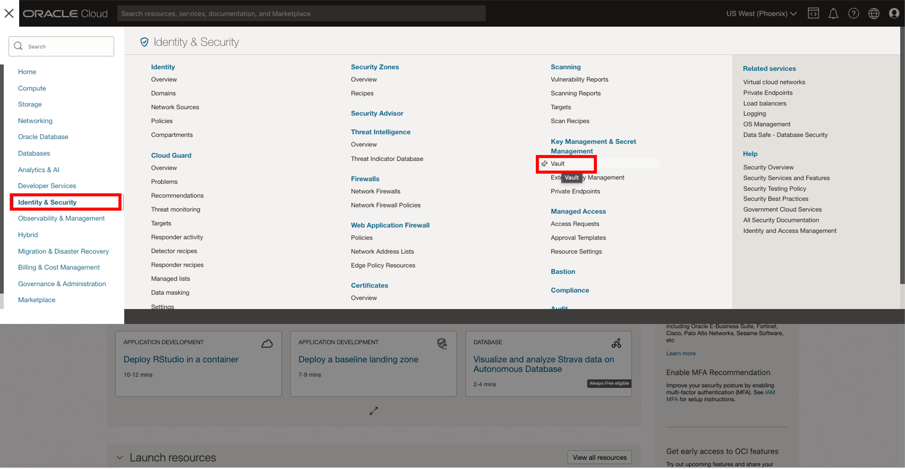

2. Create a Vault

    a. Click **Create Vault**

    b. Select the root compartment

    c. Give the vault a name

    ```bash
    <copy> HW-DB </copy>
    ```

    d. Click **Create Vault**

    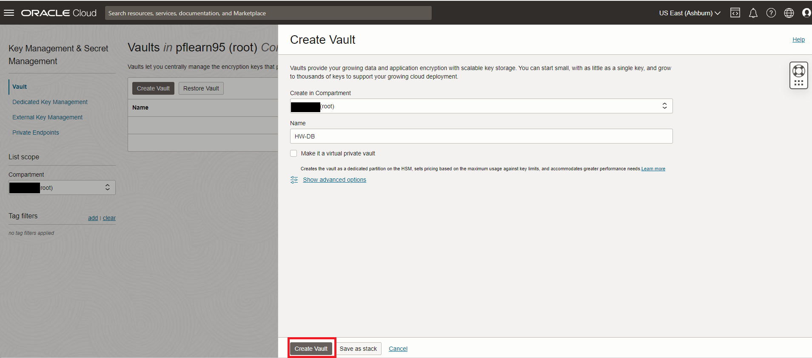
3. Create a Master Encryption Key

    a. Click on the newly created Vault

    b. Click **Create Key**

    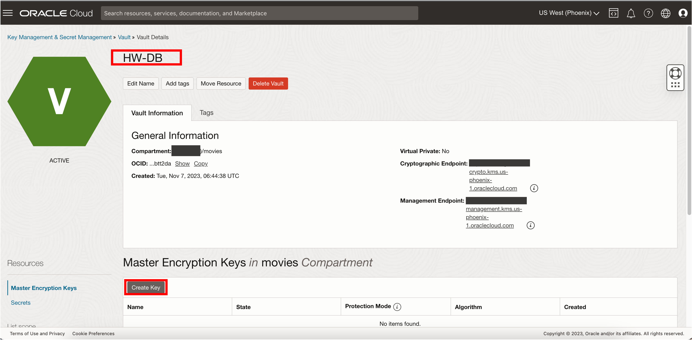

    c. Select the root compartment

    d. Give the key a name

    ```bash
    <copy> HW-DB </copy>
    ```

    e. Leave the rest configurations in default values

    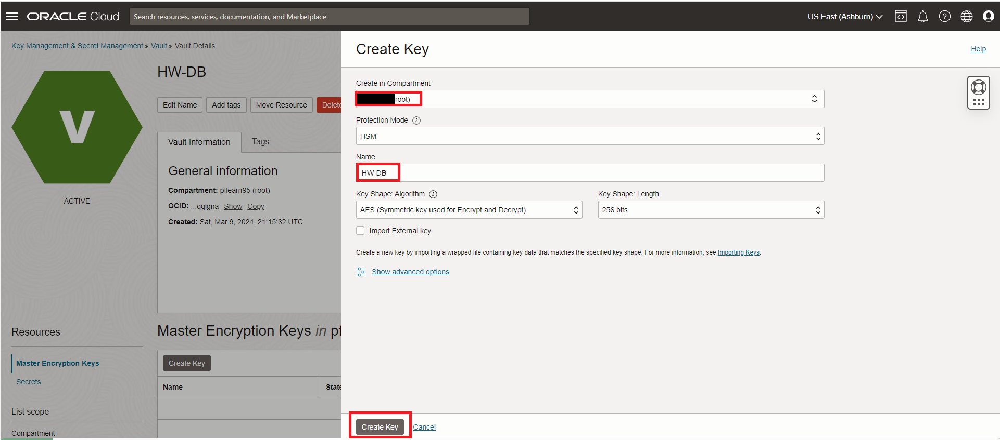

    f. Click **Create Key**

4. Create a Secret

    a. Click on **Secrets** to navigate to the secrets panel

    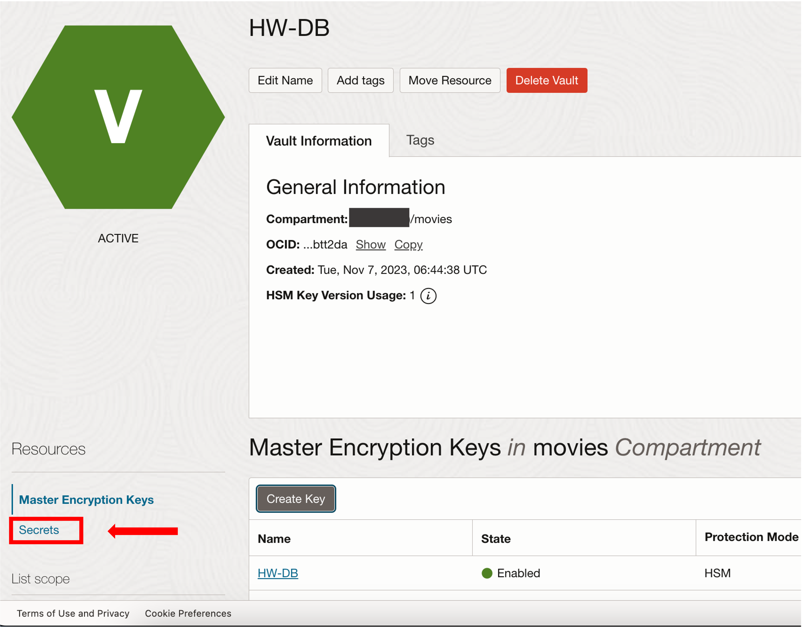

    b. Click **Create Secret**

    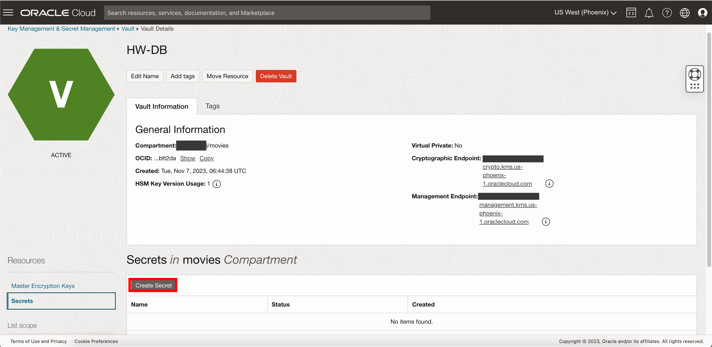

    c. Select the root compartment

    d. Give the secret a name

    ```bash
    <copy> HW-DB </copy>
    ```

    e. Select the the **Manual Encryption Generation** box

    f. In **Secret Contents**, write the password for the admin user created for your MySQL HeatWave DB System

    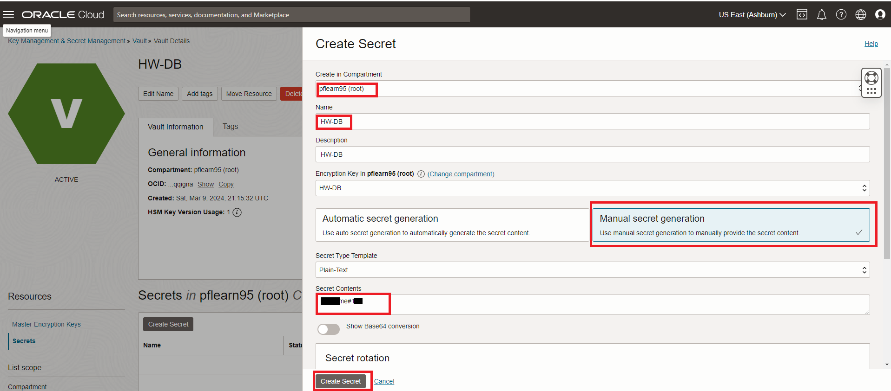

    g. Leave the rest configurations in default values

    h. Click **Create Secret**

## Task 2 Configure a Private Connection

1. From the OCI Menu, navigate to **Developer Services** and click **Connections**

    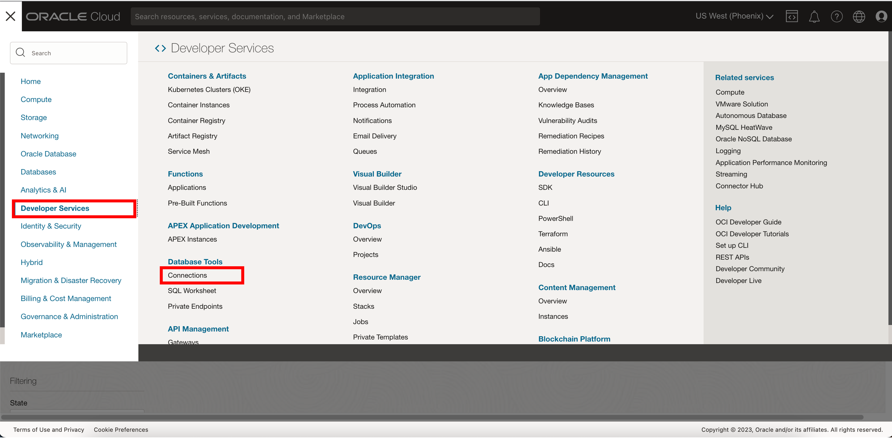

2. Create a Private Endpoint

    a. Navigate to Private Endpoints and click **Create private endpoint**

    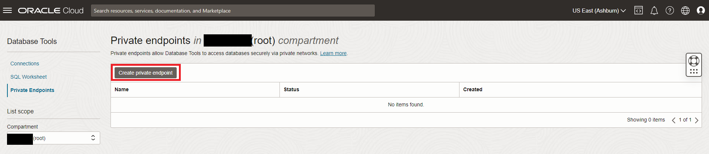

    b. Give the Endpoint a name

    ```bash
    <copy> HW-endpoint </copy>
    ```

    c. Select the root compartment

    d. Select **Enter network information**

    e. Select the **private subnet** from the roo compartment

    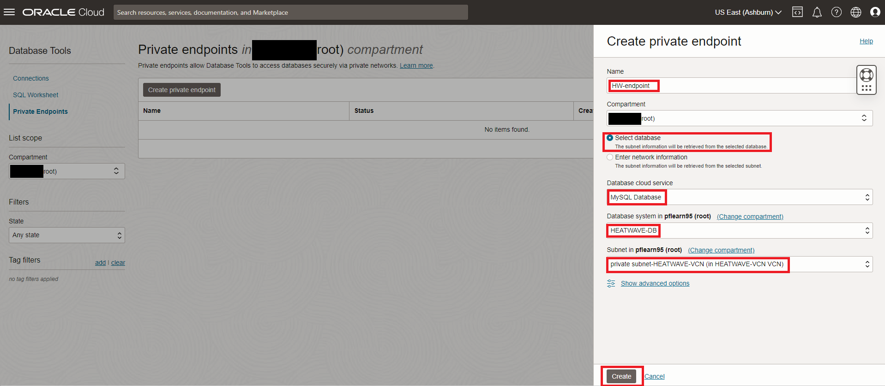

    f. Click **Create**select “Manual Secret Generation”

3. Create a Connection

    a. Navigate to Connections and click **Create connection**

    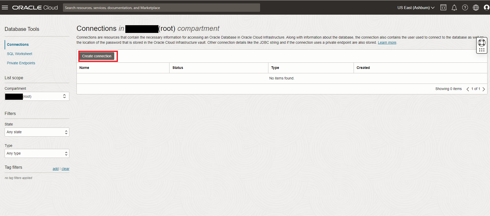

    b. Give the Endpoint a name

    ```bash
    <copy> HW-Connection </copy>
    ```

    c. Select the root compartment

    d. Select **Select database** option

    e. Select **MySQL Database** for Database cloud service

    f. Enter **admin** for username

    g. Introduce the MySQL DB System created administrator user

    h. Select the created secret that contains the matching mysql password

    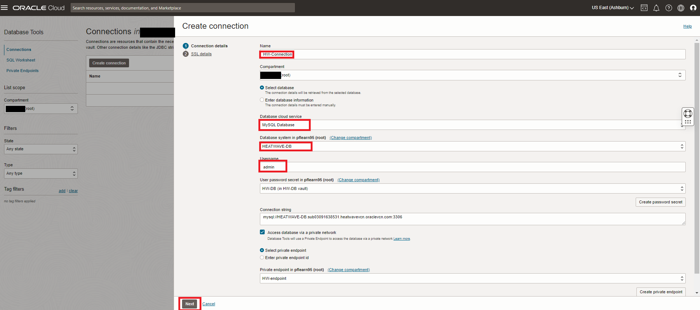

    h. Click **Next** and **Create**

## Task 3 Run SQL Worksheet

1. From the OCI Menu, navigate to **Developer Services** and click **SQL Worksheet**

    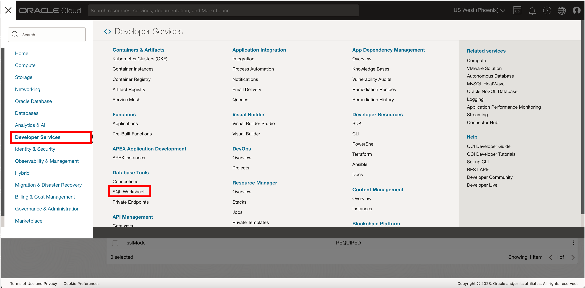

2. Select the root compartment and the created **HW-Connection**

3. Click the **SQL Worksheet** button

    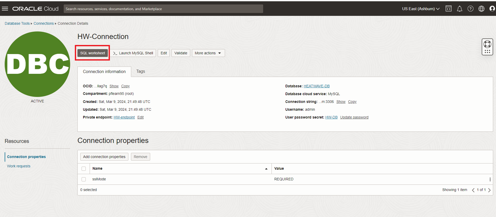


3. You can run SQL queries, in the SQL Worksheet.

    a. List the schemas

    ```bash
    <copy>show database;</copy>
    ```

    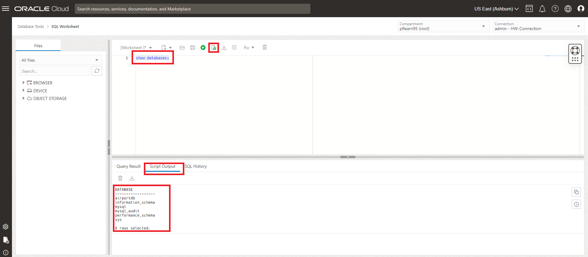

You may now **proceed to the next lab**

## Acknowledgements

- **Author** - Perside Foster, MySQL Principal Solution Engineering
- **Contributors** - Mandy Pang, MySQL Principal Product Manager,  Nick Mader, MySQL Global Channel Enablement & Strategy Manager, Selena Sanchez, MySQL Solution Engineering
- **Last Updated By/Date** - Perside Foster, MySQL Solution Engineering, March 2024